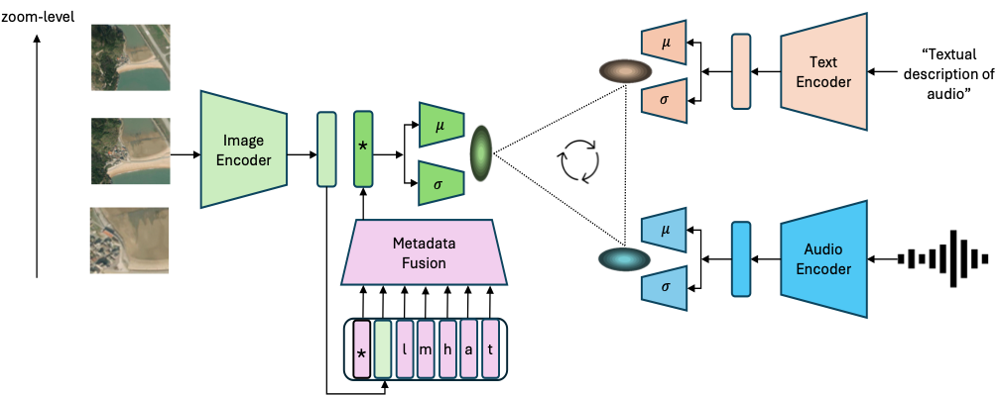

# PSM: Learning Probabilistic Embeddings for Multi-scale Zero-Shot Soundscape Mapping
### [Project Page](https://subash-khanal.github.io/PSM/index.html) | [Paper](https://arxiv.org/pdf/2408.07050) 
Implementation of 
[PSM: Learning Probabilistic Embeddings for Multi-scale Zero-Shot Soundscape Mapping](https://subash-khanal.github.io/PSM/index.html)  
in ACM Multimedia 2024


PSM combines image, audio, and text encoders to learn a probabilistic joint representation space. Metadata, including geolocation (l), month (m), hour (h), audio-source (a), and caption-source (t), is encoded separately and fused with image embeddings using a transformer-based metadata fusion module. For each encoder, 𝜇 and 𝜎 heads yield probabilistic embeddings, which are used for probabilistic contrastive loss.

## Dataset

[Request for data](https://docs.google.com/forms/d/e/1FAIpQLSdQQrewZj8jnHihKKdyZ22H4Zw6YxbUHBPddIpgbGfmCxZypQ/viewform) used in our work, available to be read by `webdataset` for both `GeoSound` and `SoundingEarth` dataset. Each sample contains `CLAP-processed` mel-spectrogram features for audio, satellite image and associated metadata. 

To download raw audios from the audio sources: `aporee`, `freesound`, and `iNaturalist`, create account (and request for API key if necessary), then find respective metadata `.csv` files located [here](https://drive.google.com/drive/folders/1KA2NSAcc92ZTFqDC_l19VCpK8nHbvlnF?usp=sharing), and utilise the following data-download scripts for each of these sources: 

`aporee`: [./geoclap/data_prep/get_SoundingEarth_raw_audio.sh](https://github.com/mvrl/PSM/blob/main/geoclap/data_prep/get_SoundingEarth_raw_audio.sh)

`iNaturalist`: [./geoclap/data_prep/iNaturalist_download.py](https://github.com/mvrl/PSM/blob/main/geoclap/data_prep/iNaturalist_download.py)

`freesound`: [./geoclap/data_prep/freesound_download.py](https://github.com/mvrl/PSM/blob/main/geoclap/data_prep/freesound_download.py)

`yfcc`: For YFCC, first `yfcc-videos` need to be downloaded and then audio should be extracted from those videos. Refer to `yahoo100m` section of [./geoclap/data_prep/README.md](https://github.com/mvrl/PSM/blob/main/geoclap/data_prep/README.md) for details on this.

## Steps

1. Clone this repo
    ```
    git clone git@github.com:mvrl/PSM.git
    cd PSM/geoclap
    ```
2. Setting up enviornment
    ```
    conda env create --file environment.yml
    conda activate sat2audio
    ```
    
    Note: Instead of `conda` it could be easier to pull docker image `ksubash/sat2audio:2.0` for the project we provide using following steps:

    ```
    docker pull ksubash/sat2audio:2.0
    docker run -v $HOME:$HOME --gpus all --shm-size=64gb -it ksubash/geoclap
    source /opt/conda/bin/activate /opt/conda/envs/sat2audio_demo
    ```

<!-- 3. Please refer to `./data_prep/README.md` for details on SoundingEarth and instructions on how to download Sentinel2 imagery. Some scipts for basic pre-processing steps required for experiments related to `PSM` are also provided there. -->

3. Copy the pre-trained checkpoint of `SATMAE` named as `pretrain-vit-base-e199.pth` provided in [this google drive folder](https://drive.google.com/drive/folders/1NJyba2hoQen_lDCgm9S4MymrsIZDQmgS?usp=share_link) to the location pointed by `cfg.satmae_pretrained_ckpt`.

5. Check `config.py` and setup paths by manually creating relevant directories if needed.

5. Assuming that the data is downloaded and paths in `config.py` are properly setup, we are now ready to run experiments related to PSM. Change directory such that we can run `geoclap` as a python module.
    ```
    cd ../
    ```

6. Assuming [wandb](https://wandb.ai/home) is set up correctly for logging purpose, we can now launch the PSM training as follows:
    ```
   python -m geoclap.train --num_workers 8 \
                            --probabilistic true \
                            --metadata_type latlong_month_time_asource_tsource \
                            --run_name GeoSound_pcmepp_metadata_sentinel \
                            --dataset_type GeoSound \
                            --sat_type sentinel \
                            --mode train \
                            --wandb_mode online
    
7. Once the training is complete and we have the appropriate checkpoint of the model, we can evaluate the cross-modal retrevial performance of the model. For example,
    ```
    python -m geoclap.evaluate --ckpt_path GeoSound_pcmepp_metadata_sentinel_best_ckpt_path \
                               --loss_type pcmepp \
                               --dataset_type GeoSound \
                               --test_zoom_level 0 \
                               --sat_type sentinel \
                               --metadata_type latlong_month_time_asource_tsource \
                               --add_text true \
                               --meta_droprate 0 \
                               --test_mel_index 0 
    ```

## Model Checkpoints

The best checkpoints for our experiments in the paper can be found [here](https://drive.google.com/drive/folders/1RaMykYcGeZTJ0W3nLuVVDv95azojt1T4?usp=sharing). Please note that these checkpoints are saved under directory with `wandb`-generated random name for each experiments, therefore refer to the file: [./geoclap/ckpt_paths.py](https://github.com/mvrl/PSM/blob/main/geoclap/ckpt_paths.py) to find appropriate checkpoint path.

## Citation
```
@inproceedings{khanal2024psm,
  title = {PSM: Learning Probabilistic Embeddings for Multi-scale Zero-Shot Soundscape Mapping},
  author = {Khanal, Subash and Eric, Xing and Sastry, Srikumar and Dhakal, Aayush and Xiong Zhexiao and Ahmad, Adeel and Jacobs, Nathan},
  year = {2024},
  month = nov,
  booktitle = {ACM Multimedia},
}
```

Follow more works from our lab: [The Multimodal Vision Research Laboratory (MVRL)](https://mvrl.cse.wustl.edu)
